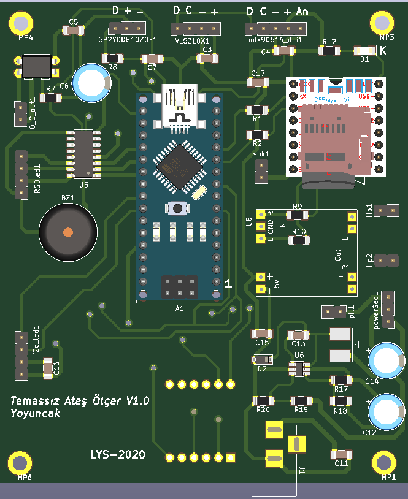

### **Touchless Fever Meter**

During the COVID-19 pandemic, many institutions, organizations and shops began to measure the temperature of their customers at the entrance. For this purpose, an officer was trying to check the fever of the customer at the entrance by measuring the fever. This meant extra workload and employment.

This system was developed to create a solution for touchless remote fever measurement without a person in charge.

MLX90614 series infrared thermometers were used in the studies. These sensors are fabricated with calibrated temperature ranges. Relevant data sheets of the company can be viewed.

  

The temperature of the user who enters the measurement range is measured from a distance (3-40 cm depending on the sensor) and an audible warning is given. In cases where the fever is high to avoid erroneous measurements, at least three more measurements are made and the result is obtained.

While the result is shown on a 4-digit, 7-segment display, the fever status is announced with an audible warning.

## Case Study video

